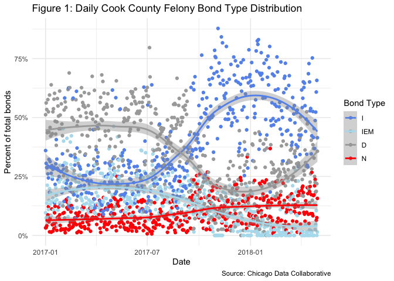
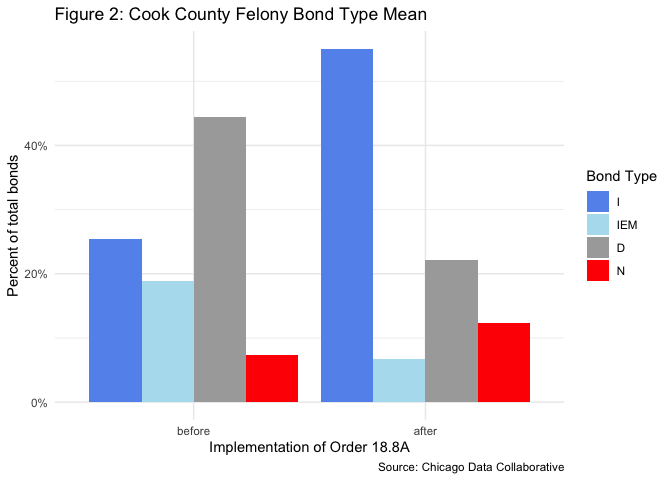
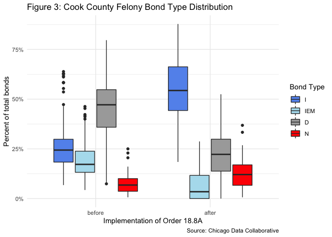
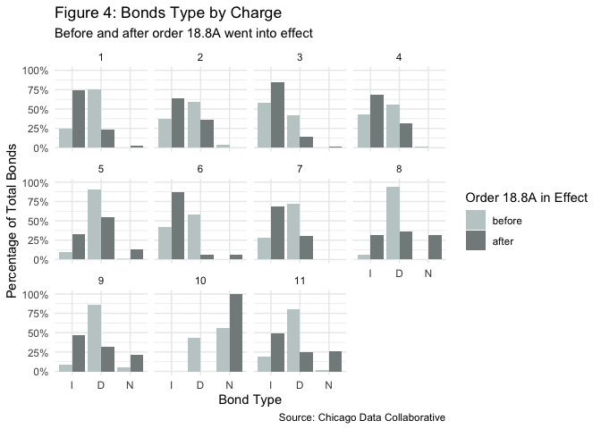
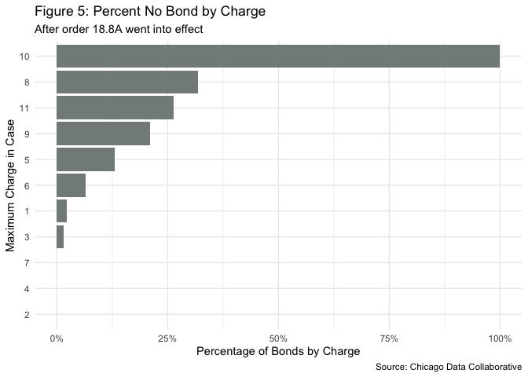

2017 Analysis: Policy Change in Cook County Bond Court
================
Micah Clark Moody
2022-05-11

This project is to better understand the past impact of bail policy. I’m
deeply indebted to the the *Coalition to End Money Bond* and *Chicago
Appleseed Foundation for Fair Courts* for publishing their cleaned data
and code with the [Chicago Data
Collaborative](https://gitlab.com/ChicagoDataCooperative) for te public
to access. This analysis primarily draws on their insights and is only
answering lingering questions I have after largely coming to understand
Order 18.8A and its impact through their research, analysis, and
reporting. [This
report](http://www.chicagoappleseed.org/wp-content/uploads/2018/02/Courtwatching-Report_Coalition-to-End-Money-Bond_FINAL_2-25-18.pdf)
is the best starting point for understanding the impact of Order 18.8A
in bond court.

***Reader note:*** This a preliminary analysis primarily for my own
understanding. If you’re hear to learn more about Order 18.8A, I
strongly suggest you read the
[report](http://www.chicagoappleseed.org/wp-content/uploads/2018/02/Courtwatching-Report_Coalition-to-End-Money-Bond_FINAL_2-25-18.pdf)
instead. This will be easier to digest, more detailed, and less likely
to have errors. If you’re interested in my analysis or the work that
went into my MA thesis on bond court, you’re in the right place.

# 2017 Bond Court Policy Change

On September 18, 2017, [General Order
18.8A](https://www.cookcountycourt.org/Manage/Division-Orders/View-Division-Order/ArticleId/2562/GENERAL-ORDER-NO-18-8A-Procedures-for-Bail-Hearings-and-Pretrial-Release)
was issued by the Chief Judge changing the rules of bond court to
“ensure no defendant is held in custody prior to trial solely because
the defendant cannot afford to post bail.” This policy change was in
response to years of organizing and advocating for an decrease reliance
on cash bail. This created a disruption in bond court, requiring facts
be presented about a defendants ability to pay and be considered by the
judge on the record. Further, for a judge sets bail in excess of what a
defendant can pay after September 18, 2017, judges have to put
additional findings on the record explaining their decision.

# This data

-   [Courtwatching
    data](https://gitlab.com/ChicagoDataCooperative/court-observation/-/tree/master)
    collected by volunteer court watchers who physically attended court
    and recorded observations for each case.
-   [Data
    description](https://gitlab.com/ChicagoDataCooperative/court-observation/-/blob/master/data_processing.Rmd),
    and I will also explain the variables relevant to this analysis
    throughout
-   [Bond court
    summary](https://gitlab.com/ChicagoDataCooperative/bond-court-dispositions)
    repository created through freedom of information act responses by
    the Cook County sheriff’s office

### Importing data

This data is linked to the GitHub repository for the initial data
collection project. The codebooks, .csv files, and data cleaning scripts
can be viewed at these links:

-   [daily_data](https://gitlab.com/ChicagoDataCooperative/bond-court-dispositions)
    is the aggregate data from the Cook County sheriff  
-   [case_data](https://gitlab.com/ChicagoDataCooperative/court-observation/-/tree/master)
    is case-level data recorded by court watchers

First, I imported the data, re-code variables as needed, and re-name
variables used for analysis using snake case formatting. When the same
variable (for example “date” and “bond_type”) appear in both data sets
they are named the same way to limit confusion about what the variable
represents and simplify joining operations.

    ## Warning: NAs introduced by coercion

# Distribution of bond types before and after implementation

### Daily bond types

**Question:** what is the distribution of bond types each day?

**Interpretation:** there is a clear shift in September when the I-bonds
(blue) become more frequent and D-bonds (grey) become less frequent.
This suggests Order 18.8A had an effect in decreasing money bail.

The rate of denying bail (red) seems to have increased. The use of
I-bonds with electronic monitoring (light blue) appears to have
decreased, which is puzzling. The report and people I spoke with suggest
this is because new, reform-oriented judges were assigned to bond court.

**Data note:** I am dropping C-bonds from the analysis. C bonds are
incredibly rare, appearing only 61 times in 3045 cases. From my
observation of bond court 5 times a week, this matches my expectations,
as it is exceedingly rare for a C-bond to be ordered, I observed 1 in
over 400 cases of observation. Thus, I will remove C-bonds from my
analysis.

<!-- -->

### Overall bond types before and after order 18.8A

**Question:** are D-bonds more prevelant before Order 18.8A is
implemented?

**Interpretation:** yes, there is a significant increase in the
percentage of I-Bonds after the order is implemented. Interestingly,
there is also an increase in no bonds, jailing pretrial defendants. In
future analysis, I am curious if this change is mirrored across charges
or if some charges (like drug possession) account for the increase in
I-Bonds while others (like more serious charges) account for the
increase in No_Bonds.

    ## `summarise()` has grouped output by 'order_18.8A'. You can override using the
    ## `.groups` argument.

<!-- -->

### Descriptive statistics on bond type

From Figure 1 and 2 we see an increase in I-bonds and No bonds after
Order 18.8A was implemented. From Figure 1, we also see substantial
variation between days. To better appreciate this variation, here are
the descriptive statistical characteristics of the data set.

I wanted to figure out descriptive stats before and after the order went
into effect. You can see this data visually represented in figure 3.

    ## [1] "Quartile summary before Order 18.8A"

    ##    percent_N          percent_I       percent_IEM        percent_D      
    ##  Min.   :0.006452   Min.   :0.0678   Min.   :0.04301   Min.   :0.07429  
    ##  1st Qu.:0.036594   1st Qu.:0.1833   1st Qu.:0.13195   1st Qu.:0.35882  
    ##  Median :0.067989   Median :0.2439   Median :0.17192   Median :0.47166  
    ##  Mean   :0.073294   Mean   :0.2541   Mean   :0.18868   Mean   :0.44428  
    ##  3rd Qu.:0.100362   3rd Qu.:0.2983   3rd Qu.:0.23823   3rd Qu.:0.54763  
    ##  Max.   :0.250000   Max.   :0.6387   Max.   :0.46296   Max.   :0.79661

    ## [1] "Standard deviation before Order 18.8A"

    ##   percent_N   percent_I percent_IEM   percent_D 
    ##  0.04343572  0.10635624  0.08031372  0.13844004

    ## [1] "Quartile summary after Order 18.8A"

    ##    percent_N          percent_I       percent_IEM        percent_D     
    ##  Min.   :0.006452   Min.   :0.1842   Min.   :0.00000   Min.   :0.0000  
    ##  1st Qu.:0.066667   1st Qu.:0.4429   1st Qu.:0.00000   1st Qu.:0.1379  
    ##  Median :0.120690   Median :0.5435   Median :0.03448   Median :0.2222  
    ##  Mean   :0.124091   Mean   :0.5509   Mean   :0.06681   Mean   :0.2215  
    ##  3rd Qu.:0.169491   3rd Qu.:0.6625   3rd Qu.:0.11667   3rd Qu.:0.2987  
    ##  Max.   :0.368421   Max.   :0.8779   Max.   :0.28729   Max.   :0.5246

    ## [1] "Standard deviation after Order 18.8A"

    ##   percent_N   percent_I percent_IEM   percent_D 
    ##  0.06691374  0.14208131  0.07160139  0.11358596

<!-- -->

# Proportion of no bond rulings before and after order 18.8A

**Question:** What cases experienced a increase in the proportion of no
bond orders after the amount of cash bail possible was constrainted by
order 18.8A?

**Interpretation:** Here, we can see that changing response to serious
crimes drove the increase in no-bail rulings. The starkest increase is
in murder charges, with all cases having bond denied after September
18th. Robbery, aggrevated battery, crimes against persons, and gun
possession are the other 4 charges to experience a significant increase
in No_Bonds and a corresponding decrease in D-Bonds.

<!-- -->

# Charges with the highest porportion of no bond ruling

**Question:** what charges have the highest rate of bond being denied?

**Interpretation:** serious felonies, primarily murder, have the highest
rates of bond being completely denied. This makes sense, given the
condition to deny bond is a finding the defendant posses a danger to an
individual or the community. Murder, specifically, is a mandatory no
bond due to [this law]().

<!-- -->

# Conclusions

### Takeaways from this data

The implementation of order 18.8A on September 18, 2017, appears to have
a significant impact on the bonds granted to defendants charged with
felonies in Cook County. In Figure 3, we see that before order 18.8A
D-Bonds, where the defendant posts money, are most common while after
the order I-Bonds, where the defendant does not post money, are more
common.

At the same time, there is an increase of denying bond, where there is
no possibility the defendant will be released. This is concentrated in
the most serious charges but still poses concerns for freedom and due
process for defendants charged with the most serious crimes.

### See the Coalition to End Money Bond’s [excellent report](http://www.chicagoappleseed.org/wp-content/uploads/2018/02/Courtwatching-Report_Coalition-to-End-Money-Bond_FINAL_2-25-18.pdf) for more information
