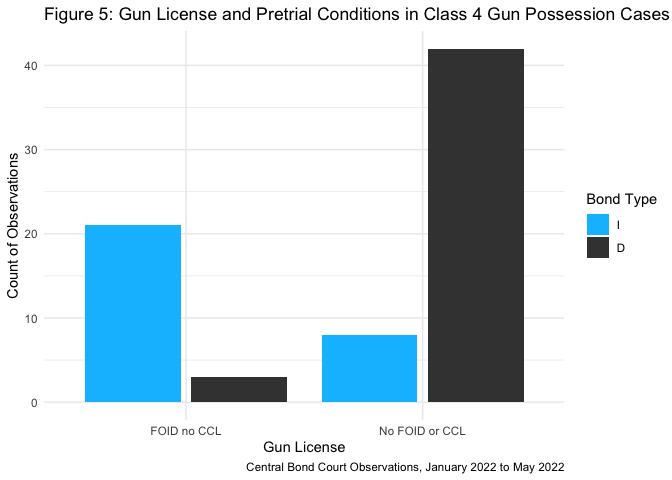
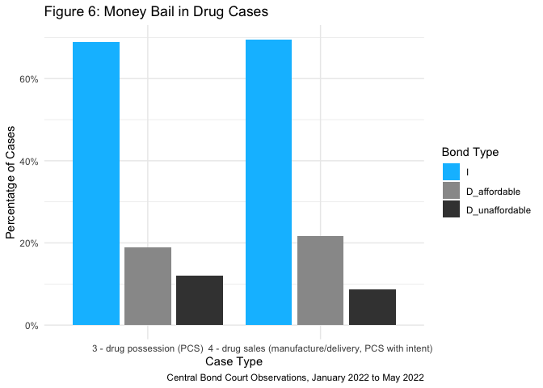

Final Paper Citations
================
Micah Clark Moody
2022-07-29

-   [Setup r environment](#setup-r-environment)
-   [Import data](#import-data)
-   [Dismissing low-level drug cases](#dismissing-low-level-drug-cases)
-   [Release in low-level cases](#release-in-low-level-cases)
-   [Gun possession with previous
    conviction(s)](#gun-possession-with-previous-convictions)
-   [Gun license and release conditions in low-level gun possession
    cases](#gun-license-and-release-conditions-in-low-level-gun-possession-cases)
-   [Drug charges pretrial conditions set
    overview](#drug-charges-pretrial-conditions-set-overview)

This `.Rmd` document has the code for quantitative claims in my final
draft of the MA Thesis *“Bond is going to be…”: Setting and justifying
pretrial conditions in Cook County Central Bond Court*. For each claim,
I’ll include the quote and code.

# Setup r environment

Run this section to import packages into the r environment. For this
section, and all sections, the `.Rmd` file for code.

# Import data

In this section, I import and clean the data from my observations. This
data is available in the “data” folder of this github repository linked
[here](https://github.com/MicahCM/bond_court/blob/main/data/data_cleaned.csv).
The raw file is available
[here](https://raw.githubusercontent.com/MicahCM/bond_court/main/data/data_cleaned.csv)
and directly inked in the code.

# Dismissing low-level drug cases

> *“In bond court, ASAs dismiss almost one in five low-level drug
> cases”* (Page 15)

As the data visualization shows, 16% of class 4 drug cases are dismissed
by prosecutors. In this analysis, “low-level” is defined as a class 4
felony charge. In the data, the variable `nole` is a dummy for case
dismissal where 1 = dismissed and 0 = no dismissed. The name `nole` is
an abbreviation of the phrase “nolle prosequi,” a Latin legal term that
prosecutors say when dismissing a case.

These results are likely an under count of dismissed cases because
judges do not always announce the charges before prosecutors move to
dismiss the case, meaning I observed cases that were dismissed without
identifying the underlying charge.

<!-- -->

# Release in low-level cases

> *“Affordable bail, money bail less than or equal to the stated ability
> to pay, is most common in low-level (class 4) felony cases”* (Page 19)

From Figure 2 we can see that over 52% of class 4 cases lead to release
on an I-Bond. Further, when and I-Bond is not set, an affordable money
bail is the next most common pretrial condition. For class 4 cases,
release through an I-Bond or affordable money bail is most common,
occuring in 76% of cases I observed.

Class 3 cases also frequently lead to release on an I-Bond or affordable
money bail. However, we can see in Table 1 the level of unaffordable
money bail is slightly higher, making release slightly less common in
class three cases.

Class 2, 1, and X charges all have lower rates of release.

This sentence could have been more precisely phrased “\[r\]elease
through no bail or affordable bail, money bail less than or equal to the
stated ability to pay, is most common in low-level (class 4) felony
cases.” This would be more precise because class 3 cases have a higher
rate of affordable bail with 58% of cases. there is a lower rate of
pretrial release overall, however, at 70% compared to the 76% release
rate for class 4 felony cases.

<!-- -->

> “In low-level cases I observed, the pretrial condition was release
> without money bail in just under half of cases.”\_ (Page 19)

For class 4 cases, defendants are released on an I-Bond (meaning without
money bail) 51% of the time. It is important to note, the results below
do not account for cases listed as D-bonds where I did not record the
amount the defendant can post or I did not record the amount of money
bail set. In 63 cases bond affordability is undefined and these results
do not appear in the final data. This is why, overall, D bond is
under-represented in this result and I-Bond is over-represented. In the
unfiltered data, I-Bond is slightly less than 50% of cases.

|                |    4 |    3 |    2 |    1 |    X |
|:---------------|-----:|-----:|-----:|-----:|-----:|
| I              | 51.5 | 12.8 | 38.2 | 45.5 |  3.7 |
| D_affordable   | 25.4 | 59.0 | 38.2 | 36.4 | 37.0 |
| D_unaffordable | 23.1 | 28.2 | 17.6 | 18.2 | 14.8 |
| No bond        |   NA |   NA |  5.9 |   NA | 44.4 |

Table 1: Bond Type Percentage by Most Serious Charge

# Gun possession with previous conviction(s)

> *“For example, release on money bail and some type of supervision is
> the common pretrial condition for defendants charged with gun
> possession who have a previous gun conviction in their history”* (Page
> 20-21)

<!-- -->

In Figure 3 we can see pretrial conditions are common in gun cases where
the defendant has a prior record. Electronic monitoring and pretrial
supervision, combined, are applied in 50.6024096% of cases with a gun
charge when the defendant has a prior record. These conditions often
overlap with high monetary bail or pretrial jailing as we can see in
Figure 3.

> *Of the class X gun possession cases I observed, prosecutors requested
> pretrial jailing half of the time.* (Page 24-25)

In gun possession cases I observed, pretrial jailing was set in half (7)
after prosecutors requested jailing and judges approved the request. In
half (7) prosecutors did not request jailing. In every case I observed
where prosecutors requested jailing the request was approved.

The “NA” observation represents a case where I observed a class X gun
possession case but did not record the pretrial condition set.

| bond_type | Total |
|:----------|------:|
| D         |     7 |
| No bond   |     7 |
| NA        |     1 |

Table 2: Count of Bond Type for Class X Gun Possession Cases

# Gun license and release conditions in low-level gun possession cases

> *In a third of class four gun arrests, the defendant is a legal gun
> owner with a FOID card Illinois gun license* (Page 28)

In 32% of class 4 gun possession cases, the person charged had a FOID
card enabling them to legally own a weapon as we can see in Table 3. The
“CCL” Concealed Carry License is needed in addition to a FOID card for
some methods of weapon transportation including having an uncased or
loaded weapon in a car [FOID
law](https://www.ilga.gov/legislation/ilcs/ilcs3.asp?ActID=1657&ChapterID=39)
and [CCL
law](https://www.ilga.gov/legislation/ilcs/ilcs3.asp?ActID=3497&ChapterID=39).

| gun_license           | Total |
|:----------------------|------:|
| Convicted of a felony |     1 |
| FOID and CCL          |     1 |
| FOID no CCL           |    26 |
| No FOID or CCL        |    52 |
| Out of state          |     1 |

Table 3: Gun License Status in Class 4 Gun Possession Cases

> *In the cases I observed, nine of ten defendants with a FOID card are
> released on an I-Bond, the most lenient pretrial condition. In
> contrast, only two of ten defendants without a FOID card and arrested
> on gun charges were released on an I-Bond with most given money bail
> as a pretrial condition.* (Page 28)

Figure 5 demonstrates the high rate of I-Bonds for defendants with a
FOID card and the low rate of I-bonds for defendants without a FOID
card. In the count in Table 4 we can see that 3 in 24 defendants with a
FOID Card (or 12%) are required to pay money bail while 42 of 50
defendants without a FOID card (or 84%) are required to pay money bail.

<!-- -->

| gun_license    | bond_type | Total |
|:---------------|:----------|------:|
| FOID no CCL    | I         |    21 |
| FOID no CCL    | D         |     3 |
| No FOID or CCL | I         |     8 |
| No FOID or CCL | D         |    42 |

Table 4: Gun License and Pretrial Conditions in Class 4 Gun Possession
Cases

# Drug charges pretrial conditions set overview

> *Judges release two-thirds of defendants with drug charges…I observed
> consistent money bail and pretrial supervision conditions between both
> charge categories* (Page 32)

As we see in Figure 6, there are nearly identiical rates of I-bond and
D-Bond between drug cases charged as possession and drug cases charged
as manufacture and deliver. In both case types, around 65% of defendants
are released without money bail and an additional 20% of defendants are
released on affordable money bails.

<!-- -->
