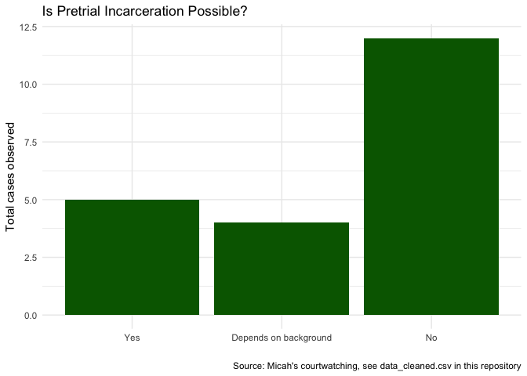

Electronic monitoring pretrial and incarceration are a false comparison:
Two Chicago examples
================
Micah Clark Moody
2022-05-04

-   [Charges involved](#charges-involved)
-   [The possibility of pretrial
    incarceration](#the-possibility-of-pretrial-incarceration)
    -   [1. Many defendants on electronic monitoring could ***never***
        be incarcerated
        pretrial](#1-many-defendants-on-electronic-monitoring-could-never-be-incarcerated-pretrial)
    -   [2. Prosecutors never asked to jail the defendants who got
        electronic
        monitoring](#2-prosecutors-never-asked-to-jail-the-defendants-who-got-electronic-monitoring)
    -   [3. Electronic monitoring is not being used as an alternative to
        pretrial
        jailing](#3-electronic-monitoring-is-not-being-used-as-an-alternative-to-pretrial-jailing)
-   [Conclusion](#conclusion)
    -   [Citations](#citations)

Putting people in jail is so normalized, electronic monitoring is often
framed as a “good” alternative to jail. This is a mistake. Electronic
monitoring represents an expansion of the punishment we apply pretrial
and an expansion expansion of the people punished pretrial. I’ve been
thinking about this since reading Gabriela Kirk’s excellent article
where she looks at academic literature and interviews defendants who
have experienced electronic monitoring, finding ***both groups***
compare electronic monitoring to incarceration [(Kirk
2020)](https://academic.oup.com/socpro/article/68/3/642/5835372?login=true).
She writes:

> Individuals’ expectations about their legal options and the power of
> the state to confine both pre- and post-conviction shaped their
> discussion of its benefits and detriments. Those who believed jail to
> be the routine and only alternative to their situation minimized the
> negative collateral consequences they experienced. However, nearly all
> respondents experienced significant disruption to their lives,
> particularly to their employment, housing, and family life…To be sure,
> there are real benefits to avoiding traditional incarceration.
> However, ***inventing new modes of confinement outside the walls of
> jails and prisons does not move away from mass incarceration nor does
> it eliminate the need to be fully attentive to possible negative
> collateral consequences*** (Kirk 2021, page 643)

Kirk found “For many on \[electronic monitoring\], this sanction is, in
fact, much more restrictive than other possible sanctions, such as being
out on bond, paying a fine, or attending weekly meetings with a
probation officer” (2021, page 647).

Advocating against electronic monitoring, the Chicago Appleseed Center
for Fair Courts has also demonstrated electronic monitoring is used as a
punishing version of pretrial rather than a altered pretrial
incarceration in their [electronic monitoring fact
sheet](https://www.chicagoappleseed.org/wp-content/uploads/2021/11/202109_10-Facts-EM-Cook-County-EM-FINAL-updated.pdf).

***My courtwatching aligns with previous findings that comparing
pretrial electronic monitoring with pretrial incarceration is a false
comparison*** ([Beckett and Murakawa
2012](https://journals.sagepub.com/doi/10.1177/1362480612442113);
[Kilgore
2013](http://www.freedomneverrests.com/wp-content/uploads/2013/11/crit-crim-hard-copy-off-print.pdf);
[Kirk
2020](https://academic.oup.com/socpro/article/68/3/642/5835372?login=true);
[Chicago Appleseed Center for Fair Courts
2021](https://www.chicagoappleseed.org/wp-content/uploads/2021/11/202109_10-Facts-EM-Cook-County-EM-FINAL-updated.pdf)).
My conclusion is based on 383 cases in Cook County Bond Court on 17
different days. There several limitations to this data, see this
repository
[README.md](https://github.com/MicahCM/bond_court/blob/main/README.md)
for details. The most important limitation to electronic monitoring
analysis it that I likely under counted electronic monitoring conditions
because I was only verbally listening to proceedings. Judges do not
always say when electronic monitoring is a condition of bond and
sometimes I was confused and may have missed conditions. This is why I
will not compare electronic monitoring rates to total case numbers.

# Charges involved

I recorded judges including electronic monitoring as a condition of bond
in 21 cases. For defendants who were released with electronic
monitoring, this table communicates the most serious charge and the
total number of cases with that charge.

Naming notes:

-   “UUW” refers to possessing a weapon without a required license (in
    the statue “unlawful use of a weapon”)
-   “AHC” requires to possessing a weapon with multiple previous
    convictions (in the statute “armed habitual criminal”)
-   “PCS” refers to drug possession (in the statute as “possession of a
    controlled substance”)
-   “Burglary” was non-residential

| Class | Charge                                       | Total Cases | Is pretrial incarceration possible? |
|:------|:---------------------------------------------|------------:|:------------------------------------|
| 3     | UUW                                          |           9 | Depends on background               |
| 4     | UUW                                          |           8 | No                                  |
| 2     | UUW                                          |           6 | Depends on background               |
| 4     | PCS                                          |           6 | No                                  |
| X     | AHC                                          |           6 | Yes                                 |
| 2     | Burglary                                     |           4 | No                                  |
| X     | Armed Violence                               |           3 | Yes                                 |
| 2     | Aggrevated battery of a peace officer        |           2 | Depends on background               |
| 2     | Robbery                                      |           2 | No                                  |
| 1     | Manufacture and delivery                     |           1 | Yes                                 |
| 2     | Manufacture and delivery of cannabis         |           1 | Yes                                 |
| 2     | Possession of a stolen motor vehicle         |           1 | No                                  |
| 2     | Theft                                        |           1 | No                                  |
| 2     | Unlawful possession of ammunition by a felon |           1 | Depends on background               |
| 2     | Violation of sex offenders registery act     |           1 | No                                  |
| 3     | Theft                                        |           1 | No                                  |
| 4     | Driving with a suspended or revoked license  |           1 | No                                  |
| 4     | Fleeing and attempting to allude             |           1 | No                                  |
| 4     | PCS Heroin                                   |           1 | No                                  |
| 4     | Retail theft                                 |           1 | No                                  |
| X     | Armed robbery                                |           1 | Yes                                 |

Table: Most serious charge in cases where electronic monitoring was a
bond condition

# The possibility of pretrial incarceration

In Illinois, three steps have to be taken for someone to be jailed
pretrial:

1.  Prosecutors charge the defendant with a “non-probationable” felony
    listed in [this
    law](https://www.ilga.gov/legislation/ilcs/fulltext.asp?DocName=073000050K5-5-3)
    and explained in [this
    article](https://illinoiscaselaw.com/sentencing-index/)
2.  Prosecutors ask the judge to jail the defendant
3.  The judge agrees with jailing the defendant based on [this
    law](https://www.ilga.gov/legislation/ilcs/fulltext.asp?DocName=072500050K110-6.1)

### 1. Many defendants on electronic monitoring could ***never*** be incarcerated pretrial

In Illinois, to jail someone pretrial at the beginning of their case
they have to be charged with a serious, called “non-probationable”,
offense listed in the law [730 ILCS
5/5-5-3](https://www.ilga.gov/legislation/ilcs/fulltext.asp?DocName=073000050K5-5-3).
I found ***pretrial incarceration was never a possibility*** as an
initial bond condition for 12 of 21 people assigned to electronic
monitoring.

<!-- -->

> A few caveats on the “possibility” of pretrial incarceration:
>
> -   The pretrial law will change on January 1 when the Pretrial
>     Fairness Act goes into effect, see descriptions
>     [here](https://endmoneybond.org/pretrialfairness/)
> -   People charged with less serious cases can be jailed pretrial if
>     they cannot pay enough money for release (called an “unaffordable
>     bond”)
> -   People charged with less serious cases can be jailed pretrial if
>     they are accused of “violating” release conditions
> -   People on electronic monitoring can be jailed pretrial if they are
>     accused of “violating” conditions of monitoring and charged with
>     additional felonies if the monitoring unit is damaged or if they
>     are accused of “escape” This means pretrial incarceration was not
>     a legal possibility for the majority of people judges assigned to
>     electronic monitoring as apart of their pretrial conditions.

### 2. Prosecutors never asked to jail the defendants who got electronic monitoring

For a defendant to be jailed pretrial prosecutors have to proactively
ask the judge to jail that person. This step was not take in ***a single
case*** I observed where electronic monitoring was ultimately a
condition of bond. This means none of the people assigned to electronic
monitoring could have been jailed without the possibility of release as
a result of their initial bond court hearing.

### 3. Electronic monitoring is not being used as an alternative to pretrial jailing

I observed 18 cases where the prosecutor did ask the judge to jail the
defendant. In all 18 cases, the Judge granted that requests and jailed
defendants without bond. This means electronic monitoring is ***not
being used as a “less restrictive condition*** by judges in their
decision to jail people pretrial.

# Conclusion

In Illinois today, comparing electronic monitoring to incarceration
pretrial is a false comparison. Kirk, Appleseed, and my courtwatching
all support this finding. We must compare bond with electronic
monitoring to release without electronic monitoring. The majority of
cases where people are required to submit to electronic monitoring are
cases when people cannot be incarcerated and, even in cases where
incarceration is legally possible, electronic monitoring is not being
used as a less restrictive condition.

### Citations

Beckett, Katherine, and Naomi Murakawa. 2012. “Mapping the Shadow
Carceral State: Toward an Institutionally Capacious Approach to
Punishment.” *Theoretical Criminology* 16(2):221–44.

Appleseed Center for Fair Courts. September 2021. “10 Facts About
Pretrial Electronic Monitoring in Cook County.”

Coalition to End Money Bond. 2020. “Key Accomplishments of the Pretrial
Fairness Act.”

Kilgore, James. 2013. “Progress or More of the Same? Electronic
Monitoring and Parole in the Age of Mass Incarceration.” *Critical
Criminology* 21(1):123–39.

Kirk, Gabriela. 2021. “The Limits of Expectations and the Minimization
of Collateral Consequences: The Experience of Electronic Home
Monitoring.” *Social Problems* 68: 642–57.
